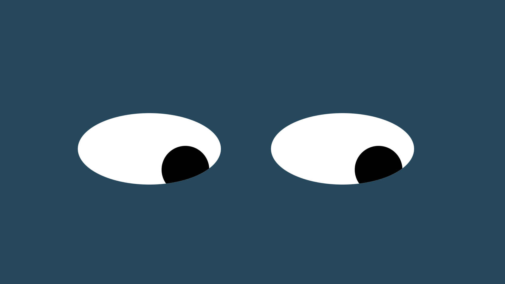

# EyeMovement
EyeMovement

EyeMovement Project: In this exercise I worked with CSS, JavaScript, and HTML to create an animation of floating eyes that follow movement based on the user's mouse. 

How to Run: Simply move your mouse around the screen and the "pupils" of the eyes will follow that mouse-movement. 

Roadmap of Future Improvements: Add additional functionality to further animate the eyes by adding periodic blinking. Also expand on the styling and colorization of the different elements by utilizing additional CSS properties. Lastly, potential to add additional facial features that may also be capable of animation. 

License information: MIT license. 
